

  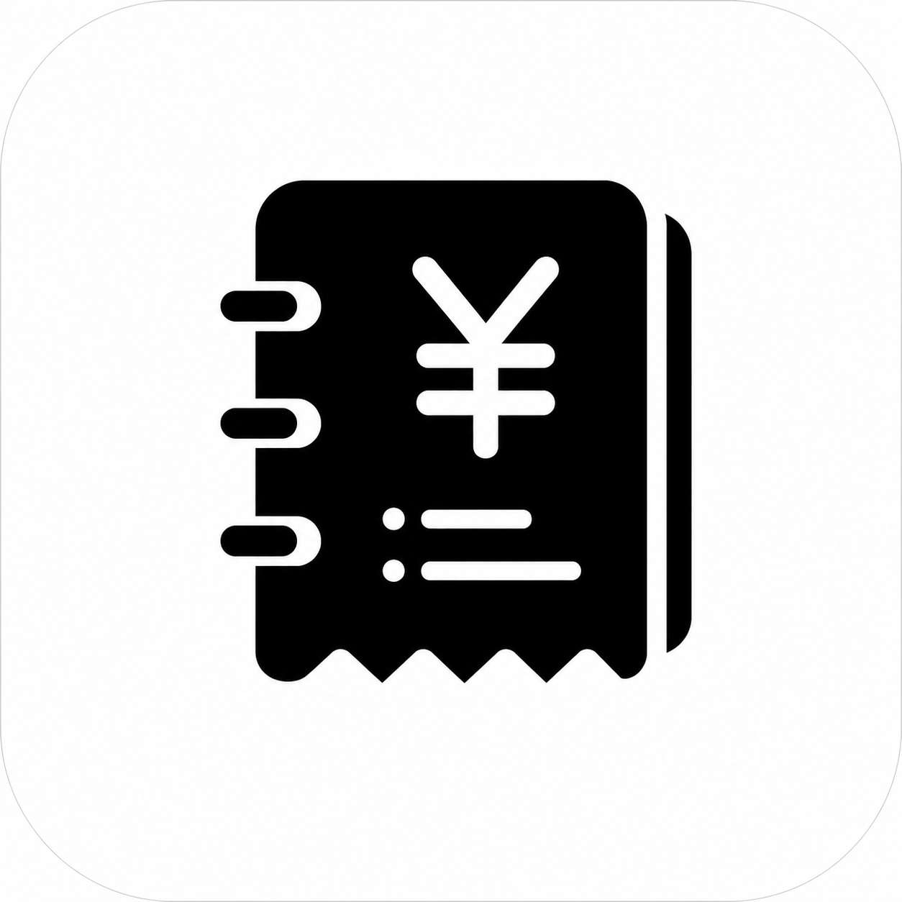

<h1 align="center">记账</h1>

简单、干净的私人账本

「记账」是一款为 iPhone 打造的轻量账本，专注于让日常收支记录更快、更自然。

它不追求复杂的财务功能，也不使用繁重的操作流程。打开、输入金额、完成，一笔账就记录好了。

  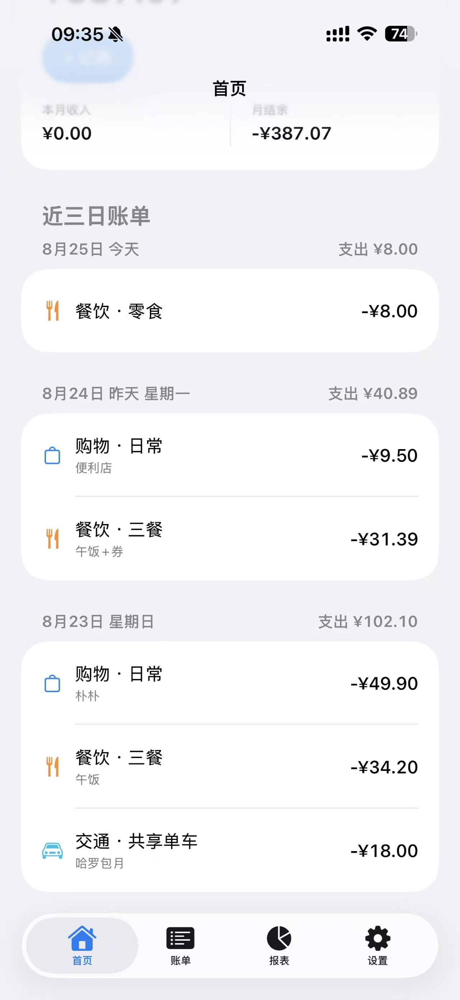

## 主要功能

- **快速记账**：记录支出与收入，支持分类、子分类、备注和日期。
- **月度概览**：在首页查看本月支出、收入、结余与近期账单。
- **完整账单**：按月份浏览历史记录，支持排序、编辑和滑动删除。
- **支出报表**：通过分类圆环和每日趋势了解本月支出构成。
- **日历视图**：按日期查看每天的支出情况与具体账单。
- **分类管理**：可隐藏系统分类，也可新建、排序和管理自己的分类。
- **深色模式**：完全跟随 iOS 系统外观自动切换。

## 界面预览

### 首页与快速记账

首页集中展示本月概览和近期账单；记账页面保持最短操作路径，让高频记录不被多余步骤打断。

  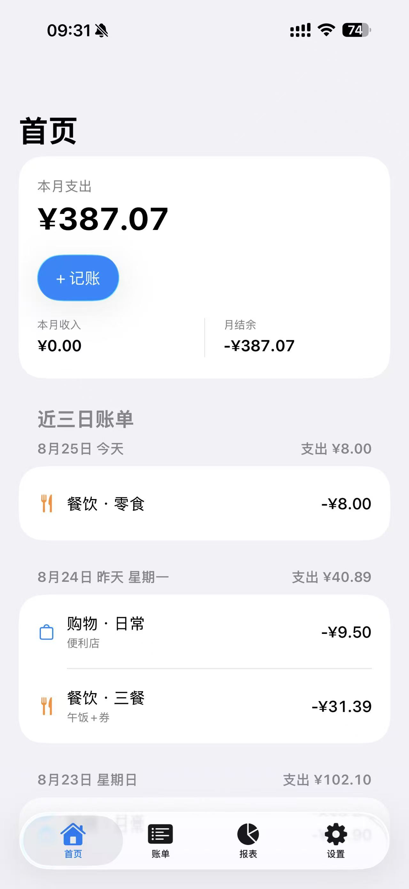
  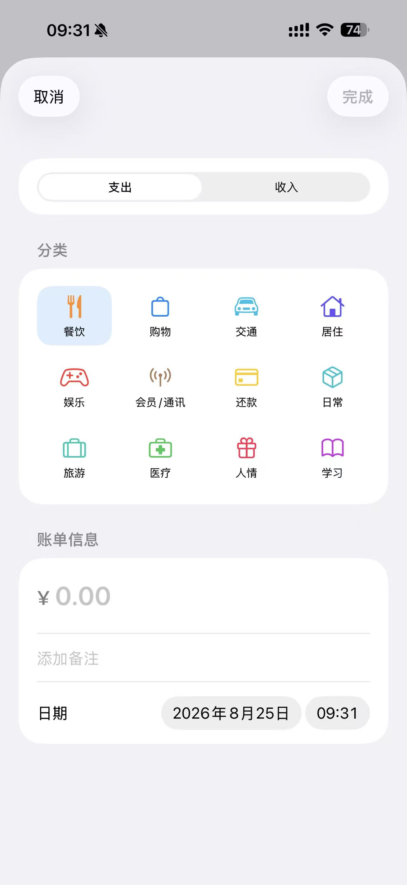

### 账单

账单按日期自然分组。点击可以查看和编辑，左滑即可删除，操作方式与 iOS 常见列表保持一致。

  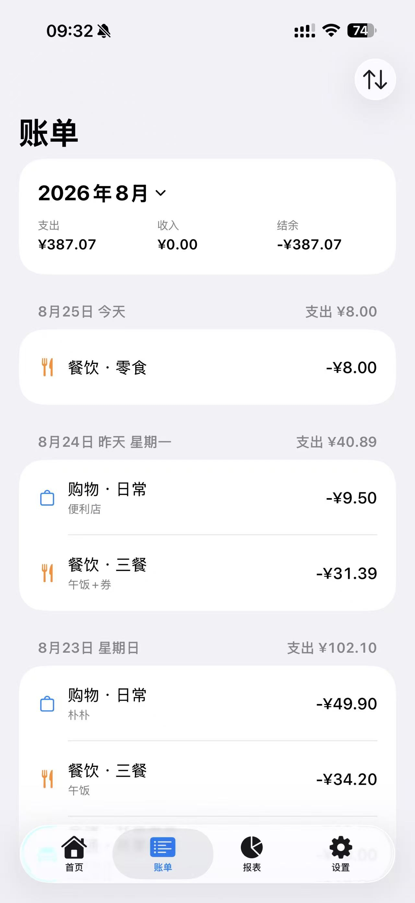
  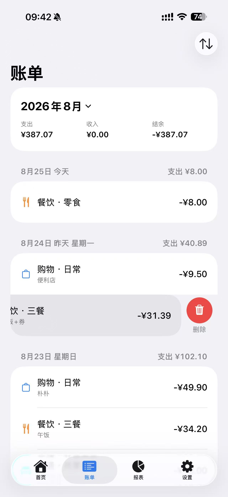

### 报表与日历

报表展示分类构成和每日支出趋势，并支持直接探索具体日期和金额；日历则提供更直观的按日回顾方式。

  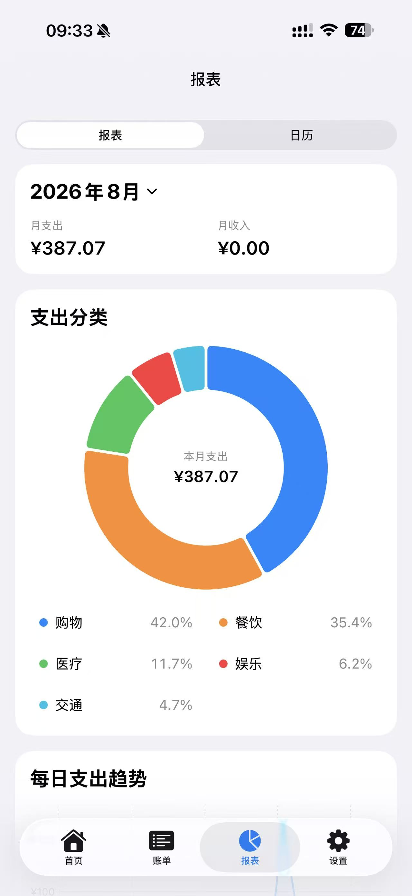
  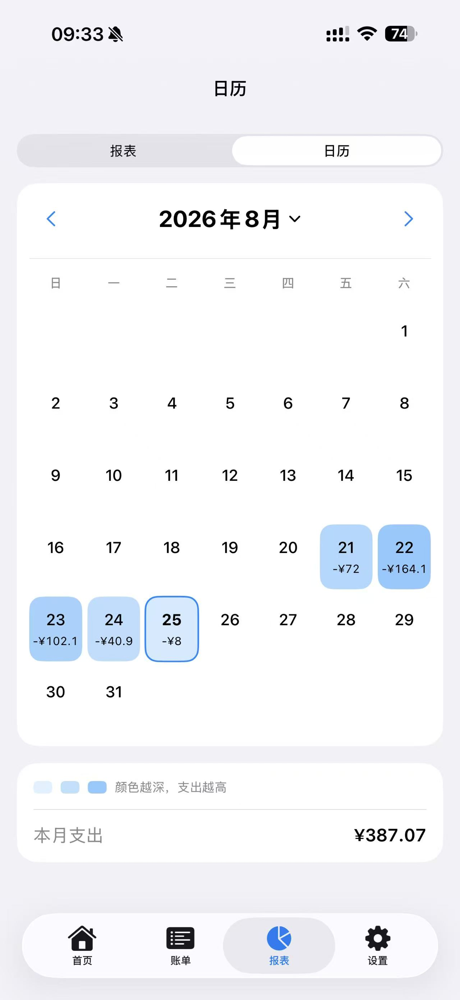

### 分类管理

系统分类开箱即用，也可以根据自己的生活习惯调整顺序、隐藏不需要的分类，或创建个性化分类。

  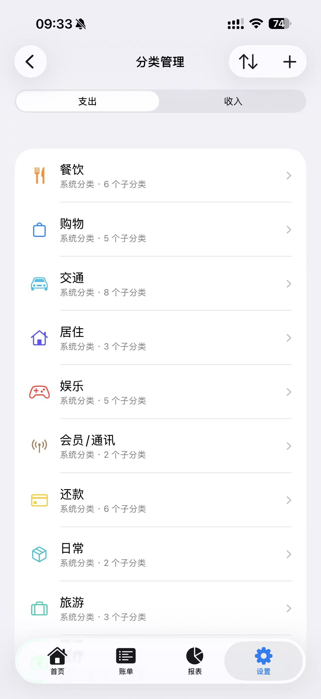
  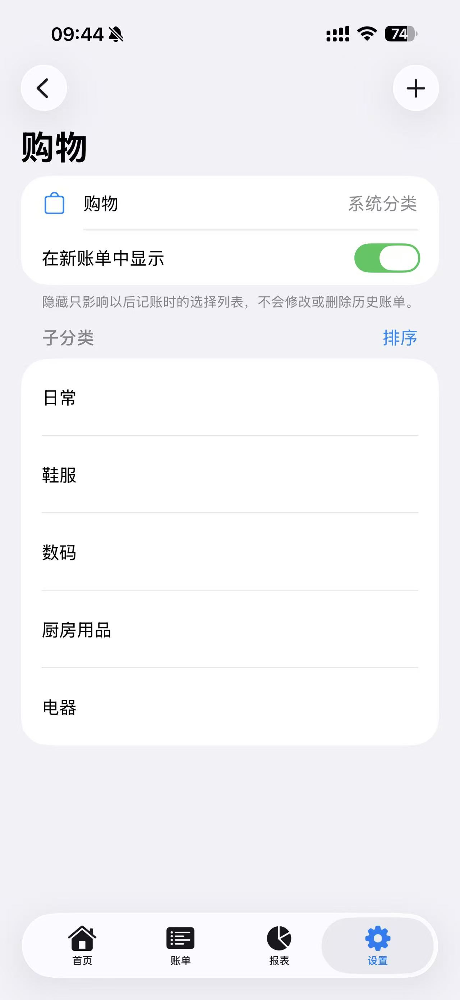

  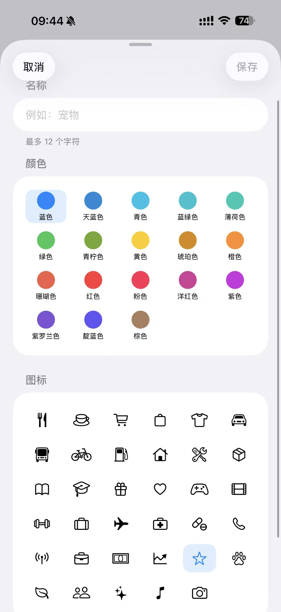
  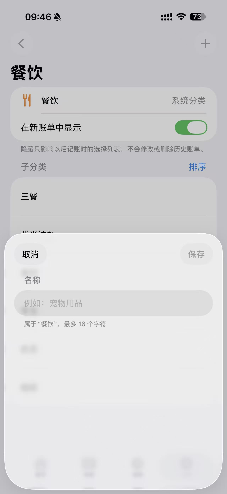

## 设计取向

- 保持克制、清晰的 iOS 原生视觉风格。
- 优先使用熟悉的系统导航、列表、弹层和手势。
- 蓝色只用于选中状态和可操作内容，分类使用清晰统一的系统色。
- 页面层级、动画与深色模式均跟随系统体验。
- 不为了增加功能数量而牺牲记账速度。

## 隐私与数据

无需注册账号，核心功能完全离线可用。

账单、分类及相关数据均保存在当前设备本地。目前不包含 iCloud 同步或其他在线数据服务。

## 当前状态

当前版本为 **1.0.1**，正在进行长期使用与真机体验测试。
